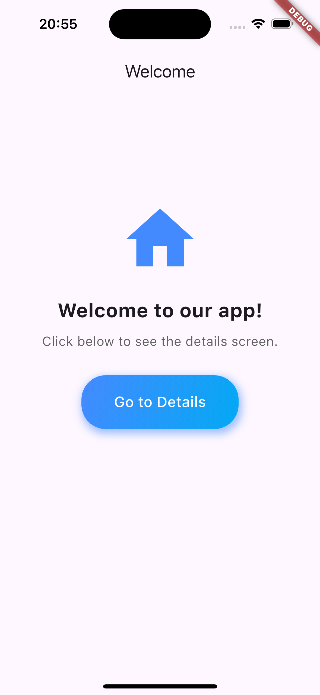
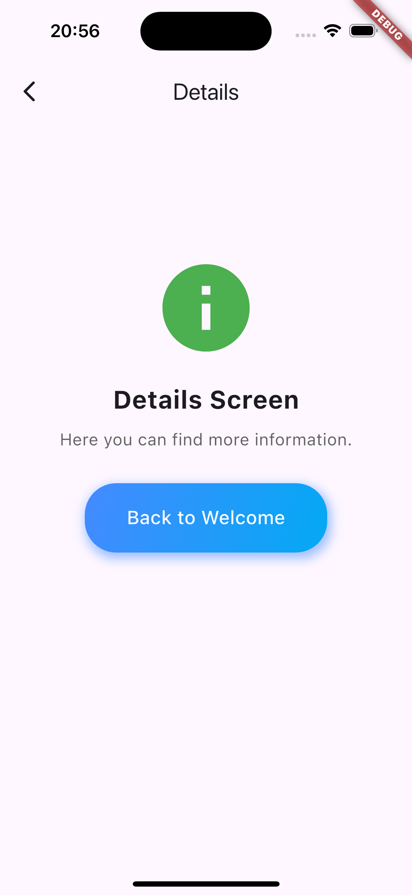
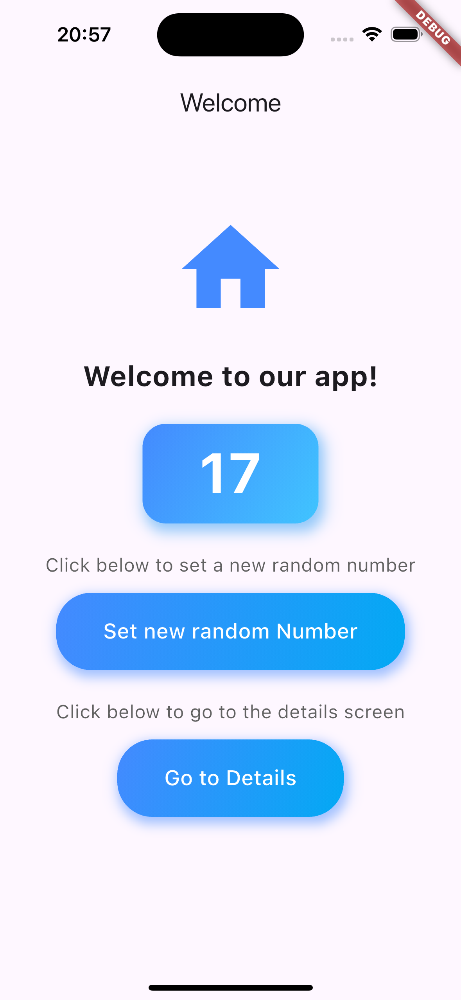
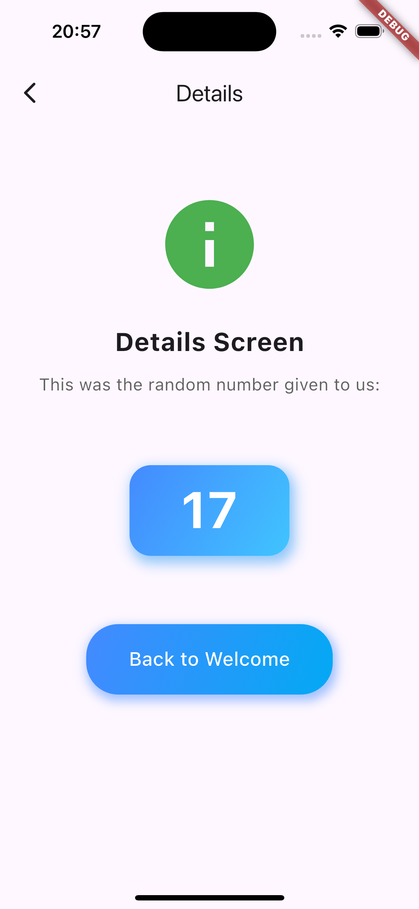

# simple_navigation_example

Eine einfache, aber schöne App, die Navigation in Flutter zeigt.

- Im "main"-Branch wird nur auf Home Screen und Details Screen ein Button gezeigt.
- Im Branch "passing_arguments" wird zusätzlich eine Zahl als Argument übergeben.

## App laufen lassen

Eventuell muss `flutter pub get` oder über VSCode `Flutter: Get Packages` ausgeführt werden.
Dann kann man in der `main.dart` auf "run" klicken.

## Screenshots

Home Screen                       |  Details Screen
:--------------------------------:|:-------------------------:
  |  

Home Screen (Arguments)           |  Details Screen (Arguments)
:--------------------------------:|:-------------------------:
  |  